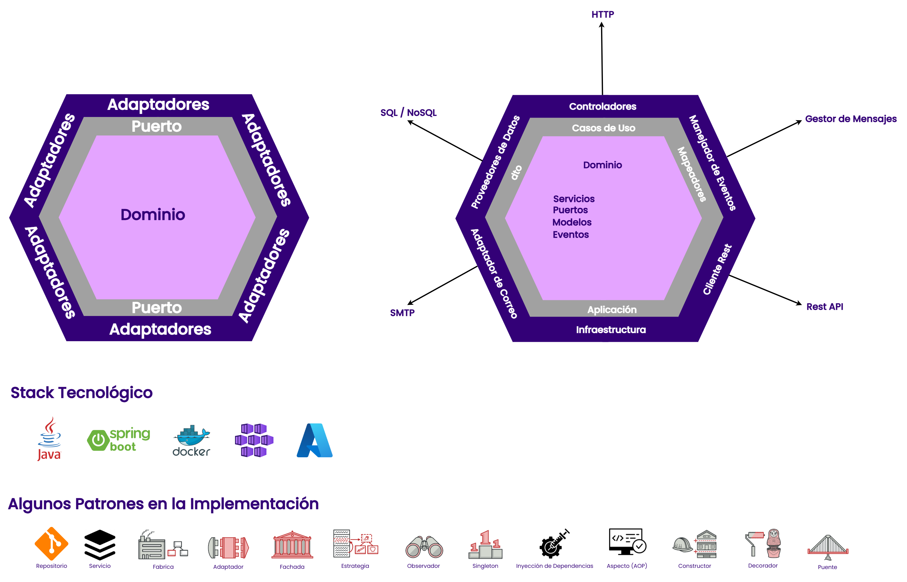

| Fecha | Descripción | Realizado por | Validado por | Fecha de Validación |
|:-:|:-:|:-:|:-:|:-:|
| 24/04/2025 | Creación del Documento | Santiago Alvarez Pinzon |**|**|

# Arquetipo

## 1. Arquitectura Hexagonal

La Arquitectura Hexagonal (también conocida como Arquitectura de Puertos y Adaptadores) es un patrón arquitectónico que promueve la separación de preocupaciones al dividir la aplicación en capas o componentes independientes. El núcleo de la aplicación (dominio) está aislado de los detalles de infraestructura y tecnología, permitiendo que los componentes externos interactúen con el núcleo a través de puertos (interfaces) y adaptadores (implementaciones concretas).

* **Aplicación en el Arquetipo:**
    * **Dominio (domain):** contiene la lógica de negocio pura, incluyendo entidades, servicios de dominio y repositorios (interfaces).
    * **Aplicación (application):** orquesta los casos de uso y actúa como intermediario entre el dominio y el mundo exterior.
    * **Infraestructura (infrastructure):** implementa los detalles técnicos y de infraestructura, como controladores, repositorios concretos, adaptadores y configuraciones.



---

## 3. Patrones de Diseño Implementados

- **Factory Method:** Utilizado para la creación de objetos complejos en la capa de dominio.
- **Builder:** Implementado para construir objetos de manera fluida y legible.
- **Adapter:** Facilita la interacción entre el núcleo de la aplicación y los detalles de infraestructura.
- **Singleton:** Aplicado en configuraciones compartidas como `ObjectMapperConfig`.

---

## 4. Distribución de Capas de Arquitectura Hexagonal

- **Dominio:** Contiene la lógica de negocio pura, incluyendo entidades y servicios de dominio.
- **Aplicación:** Orquesta los casos de uso y define cómo interactúan las capas externas con el dominio.
- **Infraestructura:** Implementa detalles técnicos como controladores, repositorios concretos y adaptadores.
- **Puertos:** Define las interfaces que conectan el dominio con el mundo exterior (entrada y salida).

---

## 5. Descripción de la Carpeta `crosscutting`

La carpeta `crosscutting` contiene componentes transversales que son utilizados en diferentes capas del proyecto. Ejemplos incluyen:

- **Configuraciones compartidas:** Como la configuración de `ObjectMapper`.
- **Utilidades comunes:** Clases reutilizables que no pertenecen a una capa específica.

---

## 6. Descripción de los Distintos Adaptadores Implementados

### Adaptadores de Entrada
- **REST Controllers:** Exponen los endpoints HTTP para interactuar con el microservicio.

### Adaptadores de Salida
- **Conexión a Bases de Datos:** Implementaciones para persistencia de datos.
- **Integración con APIs Externas:** Adaptadores para consumir servicios externos.

---

## 7. Descripción General de la Lógica Implementada

El microservicio está diseñado para gestionar la lógica de préstamos y depósitos dentro de una arquitectura hexagonal. A alto nivel, su funcionalidad se puede describir de la siguiente manera:

- **Gestión de Préstamos y Depósitos:** El microservicio permite realizar operaciones relacionadas con préstamos y depósitos, como creación, consulta, actualización y eliminación de registros asociados.
- **Separación de Responsabilidades:** La lógica de negocio está completamente aislada en la capa de dominio, asegurando que las reglas de negocio sean independientes de los detalles técnicos.
- **Orquestación de Casos de Uso:** La capa de aplicación actúa como intermediaria, coordinando las interacciones entre el dominio y los adaptadores de entrada/salida.
- **Adaptadores de Entrada:** Los controladores REST exponen endpoints HTTP para que los clientes puedan interactuar con el microservicio.
- **Adaptadores de Salida:** Se encargan de la persistencia de datos en bases de datos y de la integración con servicios externos, como APIs de terceros.
- **Pruebas de Arquitectura:** Se utilizan reglas de ArchUnit para garantizar que las dependencias entre capas respeten los principios de la arquitectura hexagonal.
- **Configuraciones Transversales:** Componentes como el `ObjectMapper` están centralizados en la carpeta `crosscutting` para ser reutilizados en todo el proyecto.

En resumen, el microservicio implementa una lógica robusta y modular que facilita la escalabilidad y el mantenimiento, respetando los principios de la arquitectura hexagonal.```